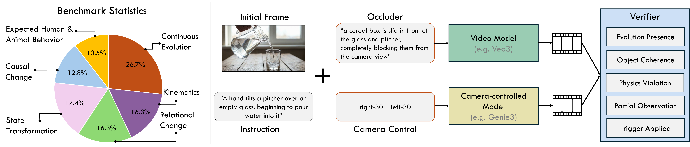

# STEVO-Bench

A melting ice cube doesn’t pause its decay just because you look away. In the physical world, **state evolution is decoupled from observation** - the gears of reality turn whether they are witnessed or not. Therefore, to be reliable world simulators, video models must be able to model evolving processes out-of-sight.

**STEVO-Bench probes the unseen**. The benchmark evalutes whether video world models can “simulate” a world beyond the pixel frame. We introduce observation control such as in-scene occlusion, camera lookaway or illumination dimming to probe whether video world models can evolve state successfully.

STEVO-Bench includes **225** tasks from **6** different categories, each of which captures a fundamentally distinct mode by which the world changes. The categories span scalar processes that accumulate gradually over time, simple few-object kinematics, irreversible structural or material transformations, and intent-driven behavior of agents etc. Together, they cover the physical, chemical, and social dimensions of world dynamics, providing a comprehensive probe of a model's internal simulation capacity.



<p align="center">
  📄 <a href="http://arxiv.org/abs/2603.13215">Paper</a> &nbsp;|&nbsp;
  📝 <a href="https://ziqi-ma.github.io/blog/2026/outofsight/">Blog</a> &nbsp;|&nbsp;
  🌐 <a href="https://glab-caltech.github.io/STEVOBench/">Website</a> &nbsp;|&nbsp;
  🤗 <a href="https://huggingface.co/datasets/JhanLiufu/StEvo-Bench">Dataset</a>
</p>

---

## Installation

```bash
git clone https://github.com/StEvo-Bench.git
cd StEvo-Bench
pip install -r requirements.txt
```

Set your API key for the VLM-based video verifiers (Gemini is used by default):
```bash
export GOOGLE_API_KEY=<your_key_here>
```

---

## Download the Benchmark

The benchmark tasks are hosted on HuggingFace. Download them using the HuggingFace CLI:

```bash
pip install huggingface_hub
hf download JhanLiufu/StEvo-Bench --repo-type dataset --local-dir benchmark/tasks
```

---

## Evaluation Pipeline

### Preparing your videos

Organize your generated videos as follows:

```
outputs/my_model_my_run/
├── task_id_1.mp4
├── task_id_2.mp4
├── ...
└── output_map.json          ← required: exactly one .json file
```

The JSON file maps each task ID to its video filename (relative to the folder):

```json
{
  "task_id_1": "task_id_1.mp4",
  "task_id_2": "task_id_2.mp4"
}
```

Task IDs must match the `id` field in the corresponding task YAML files under `benchmark/tasks/`.

### Running evaluation

Use the provided script to run all four evaluation criteria with the ensemble settings from the paper:

```bash
bash run_eval.sh outputs/my_model_my_run/
```

Results are written to `runs/` by default. To specify a different output directory:

```bash
bash run_eval.sh outputs/my_model_my_run/ my_runs/
```

To run a single criterion only:

```bash
python -m eval.eval_cli \
    --outputs outputs/my_model_my_run/ \
    --task_root benchmark/tasks/ \
    --run_dir runs/ \
    --coherence \
    --ensemble_size 3 \
    --ensemble_mode unanimous_true
```

**Criteria and recommended ensemble settings:**

| Criterion | Flag | Ensemble mode |
|---|---|---|
| Control (occlusion + trigger) | `--control` | `majority` |
| Physics (artifact) | `--artifact` | `majority` |
| Coherence | `--coherence` | `unanimous_true` |
| State Evolution | `--state` | `majority` |

`unanimous_true` for coherence means a video is only marked incoherent if all ensemble members agree — this avoids penalizing coherent videos due to false-negative judge errors.

### Evaluation output

Results are written to `runs/{output_map_stem}/`:

```
runs/output_map/
├── summary.json               ← aggregated scores across all tasks
└── per_task/
    └── {task_id}/
        ├── control_report.json
        ├── artifact_report.json
        ├── coherence_report.json
        └── se_report.json
```

### Summarizing results

After evaluation is complete, compute aggregate statistics and print a results table:

```bash
python -m eval.summarize_results --run_dir runs/my_run --print_llm
```

Add `--print_human` to also print the majority-voted human annotation scores (if human annotations are available). The script writes per-level and overall statistics back into `summary.json`.

---

## Generation Pipeline

We also provide a generation pipeline that runs a supported world model on all benchmark tasks and produces a correctly formatted output folder ready for evaluation.

```bash
python -m generation.run_world_models \
    --models veo \
    --tasks_root benchmark/tasks/ \
    --output_root outputs/ \
    --run_name my_run \
    --workers 4
```

**Key arguments:**

| Argument | Description |
|---|---|
| `--models` | Model name(s) or `all`. See `generation/configs/models.yaml` for the list of built-in models. |
| `--tasks_root` | Root directory of task folders. |
| `--output_root` | Where to save generated videos (default: `outputs/`). |
| `--run_name` | Identifier appended to the output folder name. |
| `--workers` | Parallel workers for API-based models. |
| `--overwrite` | Regenerate videos that already exist. |
| `--pattern` | fnmatch filter to run only matching tasks (e.g. `ice_on_burner*`). |

Output is written to `outputs/{model}_{run_name}/`, containing the video files and a JSON output map that can be passed directly to `run_eval.sh`.

### Adding a new model

All models are registered in `generation/configs/models.yaml`. Add a new entry under `models:` with the fields appropriate for your model type.

#### API model

```yaml
models:
  my_api_model:
    type: api
    provider: google_veo          # adapter class; currently supports google_veo, openai_sora
    prompt_field: video_WM        # which prompt field from the task YAML to use
    camera_control_field: null    # set to a key name if the model accepts camera control
    model_id: my-model-version
    api_key_env: MY_API_KEY       # environment variable holding the API key
    poll_interval: 10             # seconds between status poll attempts (async APIs)
    timeout: 600                  # max seconds to wait per video
    rpm_limit: 5                  # max requests per minute (null = unlimited)
```

Set the corresponding environment variable before running:
```bash
export MY_API_KEY=your_key_here
```

#### Local model

For a locally installed model, the pipeline expects the model repository to expose a **wrapper script** (e.g. `run_single.sh`) that accepts a standard set of arguments:

```
--prompt TEXT           The text prompt.
--output  PATH          Where to write the generated .mp4.
--init_frame PATH       Conditioning image (optional).
--camera_control STRING Camera-control parameters (optional).
```

Register it in `models.yaml`:

```yaml
models:
  my_local_model:
    type: local
    prompt_field: video_WM        # or camera_WM for camera-controlled models
    camera_control_field: null    # key in task YAML camera_control block, or null
    repo_path: /path/to/my/model  # absolute path to the model repository
    script: run_single.sh         # wrapper script, relative to repo_path
    extra_args: []                # additional CLI args forwarded verbatim to the script
    n_gpu: 8                      # total GPUs available
    rpm_limit: null
```

For models that benefit from loading weights once and processing all tasks in a single launch (recommended for large models), additionally provide:

```yaml
    daemon_script: generate_daemon.py   # script inside repo_path that implements the daemon loop
    daemon_args:                        # extra args forwarded to the daemon (e.g. checkpoint paths)
      - "--ckpt_dir"
      - "/path/to/checkpoints"
```

The daemon receives a `--tasks_json` argument pointing to a JSON file listing all tasks for this run, and processes them sequentially without reloading weights between tasks. See the existing entries in `models.yaml` (e.g. `wan22`, `HunyuanVideo15`) for complete examples.
